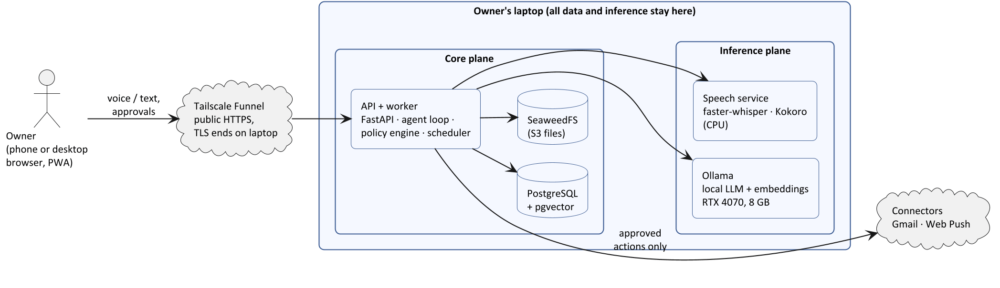

# HelpMate

A local-first agentic personal assistant and "second brain". The language model, speech recognition, speech synthesis and all personal data stay on hardware the owner controls. Every change the agent wants to make needs one-tap approval and is logged.

ENG TECH 4FD3 Senior Engineering Project, Fall 2026: Aman Takher, Jaskaran Bedi, Pratham Chauhan.



## Quickstart (all fakes, no GPU, no database)

```powershell
copy .env.example .env
cd backend;  uv sync; uv run helpmate-api          # http://127.0.0.1:8000/api/health
cd web;      npm install; npm run dev               # http://localhost:5173
# or run everything at once:
./scripts/dev.ps1
```

Try: *"remind me to call mom in 1 minute"* → an approval card appears → **Approve** → about a minute later the reminder fires (the log notifier prints it; with Web Push enabled it reaches your phone).

Full setup for the GPU machine (Ollama, speech models, Postgres, Tailscale): [docs/setup-windows.md](docs/setup-windows.md).

## How the pieces plug together

Every external dependency sits behind a **port** (a Python `Protocol` in `backend/src/helpmate/domain/ports.py`). An environment variable picks the adapter, and every seam starts out as a fake:

| Seam | Switch | Owner |
|---|---|---|
| Agent loop + policy engine | `HELPMATE_AGENT=scripted\|loop` | A |
| LLM / embeddings (Ollama) | `HELPMATE_LLM=fake\|ollama` | A |
| Repositories (Postgres + pgvector) | `HELPMATE_REPO=memory\|postgres` | B |
| Scheduler / job queue | `HELPMATE_SCHEDULER=dev\|pg` | B |
| Auth (password + TOTP) | `HELPMATE_AUTH=dev\|totp` | B |
| Notifications (Web Push) | `HELPMATE_NOTIFIER=log\|webpush` | C |
| Speech-to-text / text-to-speech | `HELPMATE_STT`, `HELPMATE_TTS` = `fake\|http` | C |
| Web app ↔ API | `VITE_API_MOCK=1\|0` (MSW mocks in the browser) | C |

`GET /api/health` reports which adapter is active for each seam, and the web app's **System status** page shows it.

The HTTP API contract is [`contracts/openapi.yaml`](contracts/openapi.yaml). It is generated from the FastAPI schemas, and CI fails if it drifts. See [docs/api-contract.md](docs/api-contract.md).

## Repo layout

```
backend/          FastAPI core: API, agent, memory, policy, worker (modular monolith, ports & adapters)
services/speech/  speech service: faster-whisper (STT) + Kokoro (TTS), CPU, separate process
web/              React + TypeScript PWA (installable, push notifications, push-to-talk)
contracts/        openapi.yaml — the shared HTTP contract
infra/            docker-compose: Postgres + pgvector, SeaweedFS (S3)
scripts/          dev.ps1, export_openapi.py, bench_models.py
docs/             plan, architecture, setup, ADRs
```

## Working together

- Branch from `main` as `feat/<area>-<short-desc>`, open a PR, get 1 review and green CI, then squash-merge.
- Commit messages follow [Conventional Commits](https://www.conventionalcommits.org/) (`feat(web): …`, `fix(agent): …`).
- Changes to `contracts/`, `domain/` or `api/schemas/` need all three reviewers (see `.github/CODEOWNERS`). Only additive changes after week 2.
- Never commit `.env`, audio, model files or real personal data.
